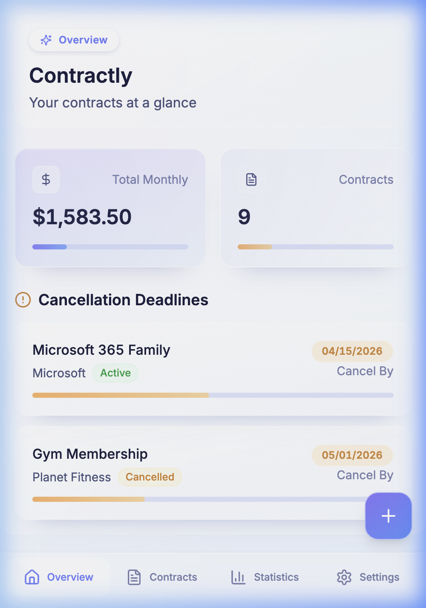
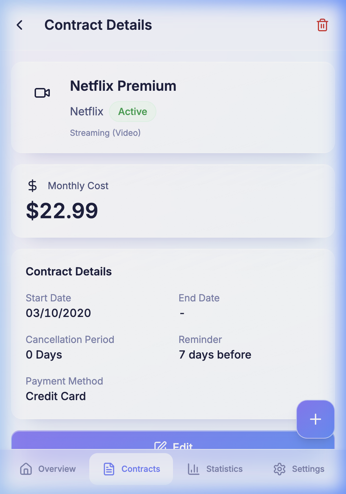
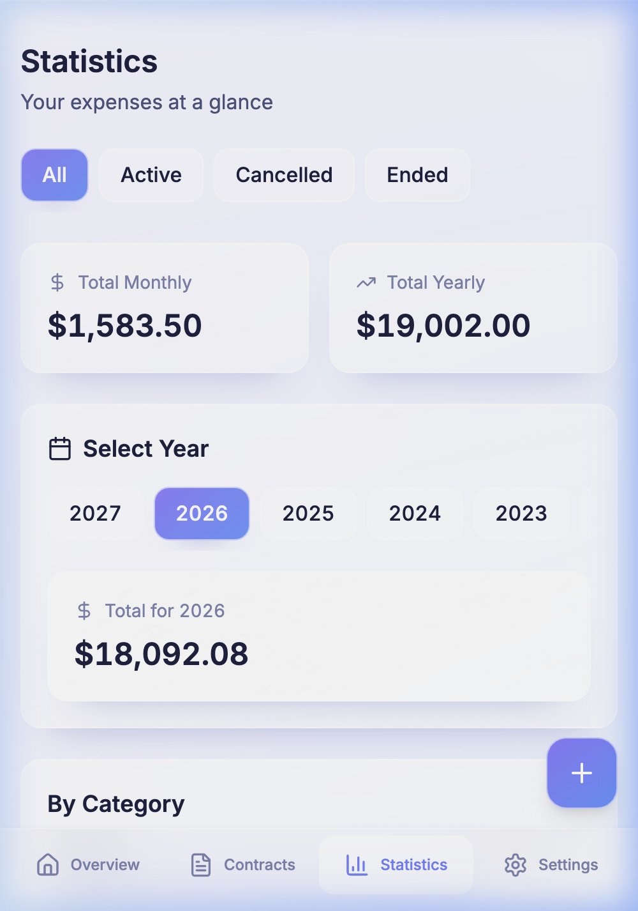

# Contractly

**A privacy-first contract manager for your subscriptions and recurring bills.**

🚀 **[Live App](https://tobiasre.github.io/Contractly/)**

All data stays on your device — no accounts, no servers, no tracking. Built as a PWA so it works offline and installs like a native app.

[](https://kit.svelte.dev)
[](https://www.typescriptlang.org)
[](https://tailwindcss.com)
[](LICENSE)

<br/>

<div align="center">
  
  &nbsp;&nbsp;&nbsp;
  
  &nbsp;&nbsp;&nbsp;
  
</div>

<br/>

---

## Features

- **50+ contract categories** — telecoms, insurance, energy, streaming, finance, and more
- **Smart defaults** — cancellation periods and reminder intervals pre-filled per category
- **Deadline alerts** — browser push notifications before cancellation windows close
- **Import & export** — CSV and Excel (XLSX) for easy migration
- **Backup & restore** — full JSON snapshots of your data
- **Bilingual** — German and English, switchable at any time
- **Zero network requests** — data lives in IndexedDB on your device

## Getting Started

```bash
npm install
npm run dev
```

Open [http://localhost:5173](http://localhost:5173).

```bash
npm run build    # production build
npm run preview  # preview the build locally
```

## Tech Stack

| Layer | Choice |
|---|---|
| Framework | SvelteKit (static adapter) |
| Styling | Tailwind CSS |
| Storage | Dexie.js (IndexedDB) |
| Charts | Chart.js |
| Import/Export | SheetJS + Papa Parse |
| Icons | Lucide |
| PWA | Vite PWA Plugin |
| i18n | svelte-i18n |
| Testing | Vitest + Testing Library |

## Project Structure

```
src/
├── lib/
│   ├── components/   # Reusable UI components
│   ├── data/         # Category and provider definitions
│   ├── db/           # Dexie database schema and helpers
│   ├── stores/       # Svelte stores (i18n, notifications, search)
│   └── utils/        # Date, currency, export, backup utilities
└── routes/           # SvelteKit file-based pages
```

## Privacy

Contractly is designed so your data never leaves your device:

- No backend, no accounts, no login
- No analytics or telemetry of any kind
- Static deployment — the server only serves HTML, JS, and CSS
- You control your data through export and backup

## Contributing

Contributions are welcome. Please read [CONTRIBUTING.md](CONTRIBUTING.md) before opening a pull request.

## License

[MIT](LICENSE)
